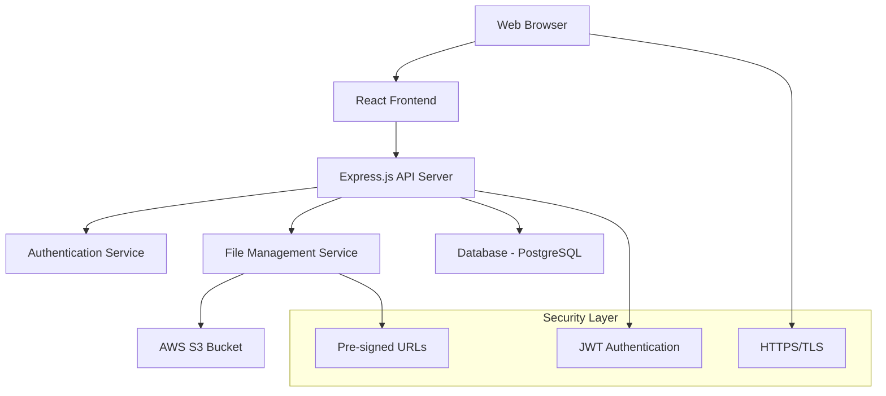

# Design Document

## Overview

The Freehold Document Sharing Platform is a web-based application that provides secure document storage and sharing capabilities for freehold community members. The system uses a modern web architecture with AWS S3 for file storage, implementing authentication, file management, and secure access controls.

The platform follows a three-tier architecture: a React-based frontend for user interaction, a Node.js/Express backend API for business logic and authentication, and AWS S3 for secure file storage with a database for metadata management.

## Architecture

### High-Level Architecture



### Technology Stack

**Frontend:**
- React.js with TypeScript for type safety
- Material-UI or Tailwind CSS for responsive design
- Axios for API communication
- React Router for navigation

**Backend:**
- Node.js with Express.js framework
- TypeScript for type safety
- JWT for authentication tokens
- Multer for file upload handling
- AWS SDK for S3 integration

**Database:**
- PostgreSQL for user accounts and file metadata
- Tables: users, documents, categories, upload_sessions

**Infrastructure:**
- AWS S3 for file storage with encryption
- HTTPS/TLS for secure communication
- Environment-based configuration

## Components and Interfaces

### Frontend Components

**AuthenticationComponent**
- LoginForm: Handles user credential input and validation
- AuthGuard: Protects routes requiring authentication
- SessionManager: Manages JWT tokens and session state

**DocumentManagementComponent**
- DocumentList: Displays paginated list of documents with filters
- FileUpload: Drag-and-drop interface with progress indicators
- CategoryFilter: Allows filtering by document categories
- DocumentViewer: Handles document preview and download

**UIComponents**
- Header: Navigation and user menu
- Sidebar: Category navigation
- LoadingSpinner: Visual feedback for async operations
- ErrorBoundary: Error handling and user feedback

### Backend Services

**AuthenticationService**
```typescript
interface AuthService {
  login(credentials: LoginCredentials): Promise<AuthResponse>
  validateToken(token: string): Promise<UserInfo>
  refreshToken(refreshToken: string): Promise<AuthResponse>
}
```

**FileManagementService**
```typescript
interface FileService {
  uploadFile(file: File, metadata: FileMetadata): Promise<UploadResponse>
  getFileList(userId: string, filters?: FileFilters): Promise<FileInfo[]>
  generateDownloadUrl(fileId: string, userId: string): Promise<string>
  deleteFile(fileId: string, userId: string): Promise<boolean>
}
```

**S3Service**
```typescript
interface S3Service {
  uploadToS3(file: Buffer, key: string): Promise<S3UploadResult>
  generatePresignedUrl(key: string, expiration: number): Promise<string>
  deleteFromS3(key: string): Promise<boolean>
}
```

## Data Models

### User Model
```typescript
interface User {
  id: string
  email: string
  firstName: string
  lastName: string
  role: 'member' | 'admin'
  createdAt: Date
  lastLogin: Date
  isActive: boolean
}
```

### Document Model
```typescript
interface Document {
  id: string
  fileName: string
  originalName: string
  fileSize: number
  mimeType: string
  s3Key: string
  category: string
  uploadedBy: string
  uploadedAt: Date
  description?: string
  tags: string[]
}
```

### Category Model
```typescript
interface Category {
  id: string
  name: string
  description: string
  createdAt: Date
  documentCount: number
}
```

## Security Implementation

### Authentication Flow
1. User submits credentials to `/api/auth/login`
2. Server validates credentials against database
3. Server generates JWT token with user claims
4. Client stores token securely (httpOnly cookie or secure storage)
5. Client includes token in Authorization header for protected requests

### File Access Security
1. All file operations require valid JWT token
2. S3 objects are private with no public access
3. Download URLs are pre-signed with 15-minute expiration
4. File uploads are validated for type and size limits
5. S3 bucket uses server-side encryption (AES-256)

### API Security
- CORS configuration for allowed origins
- Rate limiting on authentication endpoints
- Input validation and sanitization
- SQL injection prevention with parameterized queries
- XSS protection with content security policy

## Error Handling

### Frontend Error Handling
- Global error boundary for React component errors
- API error interceptors with user-friendly messages
- Network error handling with retry mechanisms
- Form validation with real-time feedback

### Backend Error Handling
- Centralized error middleware for consistent responses
- Structured error logging with correlation IDs
- Graceful degradation for S3 service unavailability
- Database connection error recovery

### Error Response Format
```typescript
interface ErrorResponse {
  error: {
    code: string
    message: string
    details?: any
    timestamp: string
    correlationId: string
  }
}
```

## Testing Strategy

### Unit Testing
- Jest for JavaScript/TypeScript unit tests
- React Testing Library for component testing
- Mock AWS SDK calls for S3 operations
- Database operations testing with test containers

### Integration Testing
- API endpoint testing with supertest
- Database integration tests
- S3 integration tests with localstack
- Authentication flow testing

### End-to-End Testing
- Cypress for user workflow testing
- File upload and download scenarios
- Authentication and authorization flows
- Cross-browser compatibility testing

### Security Testing
- JWT token validation testing
- File access permission testing
- Input validation and sanitization testing
- Rate limiting verification

## Performance Considerations

### File Upload Optimization
- Chunked upload for large files
- Progress tracking and resumable uploads
- File type validation before upload
- Compression for applicable file types

### Database Optimization
- Indexed queries for file searches
- Pagination for large document lists
- Connection pooling for database efficiency
- Caching for frequently accessed metadata

### S3 Optimization
- Multipart uploads for files > 100MB
- CloudFront CDN for faster downloads (optional)
- S3 Transfer Acceleration for global users
- Lifecycle policies for old file management

## Deployment Architecture

### Environment Configuration
- Development: Local PostgreSQL + LocalStack S3
- Staging: AWS RDS + S3 with test data
- Production: AWS RDS + S3 with backup strategies

### Infrastructure Requirements
- Web server (Node.js runtime)
- PostgreSQL database
- AWS S3 bucket with proper IAM policies
- SSL certificate for HTTPS
- Domain name and DNS configuration